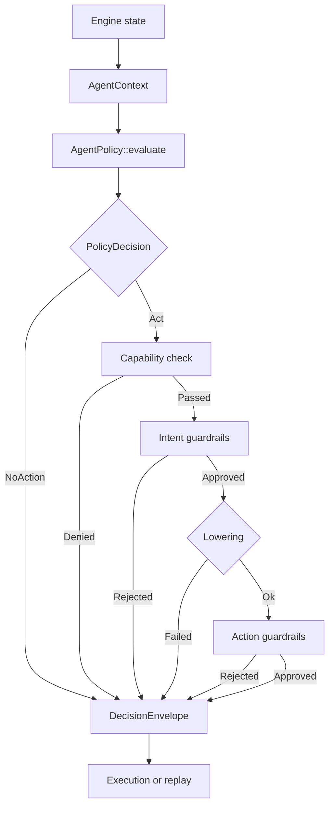

# Nautilus Agents


[](https://discord.gg/NautilusTrader)

Open agent protocol for [NautilusTrader](https://nautilustrader.io).

This crate defines the contract between an agent policy and the Nautilus
trading engine. Agents observe state, express decisions through a
structured protocol, and every cycle is recorded for replay and audit.

- Automate backtest iteration: hypotheses, parameter sweeps, result comparison.
- Monitor live systems: detect anomalies, reduce exposure, escalate.
- Record every decision for reproducible analysis.

> [!WARNING]
> Early alpha. The API is not stable and may change between versions.
> Research and risk management workflows are the current focus.
> Execution-tier features (entry orders, limit strategies) are not yet
> implemented.

## Platform

[NautilusTrader](https://nautilustrader.io) is an open-source,
high-performance, production-grade algorithmic trading platform. It lets
traders backtest automated strategies on historical data with an
event-driven engine, then deploy those same strategies live with no code
changes.

NautilusTrader's design, architecture, and implementation philosophy put
correctness and safety first. The platform targets backtesting and live
trading workloads where mistakes cost real money.

## What this crate includes

`nautilus-agents` is the open protocol layer. It sits on top of the open
NautilusTrader crates and reuses their real model types.

- `AgentContext`: owned, bounded snapshot of engine state built from
  `QuoteTick`, `Bar`, `AccountState`, `PositionSnapshot`, `OrderSnapshot`,
  and `PositionStatusReport`.
- `AgentPolicy`: the trait a policy implements.
- `PolicyDecision`: `Act(AgentIntent)` or `NoAction`.
- `AgentIntent`: semantic actions with execution constraints.
- `CapabilitySet`: explicit observation and action permissions.
- Intent and action guardrail traits.
- Lowering from `AgentIntent` to `RuntimeAction`.
- `DecisionPipeline`: the policy, capability, guardrail, and lowering loop.
- `DecisionEnvelope`: the canonical record for one decision cycle.
- `DecisionRecorder`: line-delimited JSON recording for envelopes.

## How the pieces fit together

The crate keeps agent reasoning separate from execution details:



## What this crate does not ship

- An LLM runtime, agent harness, or prompt framework.
- A chat UI or Telegram-style control surface.
- The live MCP or axum server.
- Broker IDs, venue credentials, or hosted execution infrastructure.
- Hosted replay storage, dashboards, or fleet orchestration.
- RBAC, approvals, or team workflow services.

You bring your own runtime. A separate server layer can sit on top of this
protocol for live venue access and product features.

## Capability tiers

The protocol defines three capability tiers, ordered by where agents
deliver the most value first.

**Research.** Backtest iteration, hypothesis testing, parameter
optimization, result comparison. No venue risk, no capital at stake.
The reasoning an agent does well and static rules handle poorly.

**Risk and reliability.** Anomaly detection, exposure reduction, order
cancellation, strategy pause, human escalation. Live but defensive:
the agent monitors and protects.

**Execution.** Agent-driven entry, limit orders, venue-specific
parameters. The full trading surface, unlocked after research and risk
management are proven.

## Design principles

**Deny-by-default capabilities.** An agent can only observe data and emit
intents that its `CapabilitySet` explicitly grants. Everything else is
denied. This follows the object-capability model: authority comes from
possession of a capability token, not from ambient access.

**Intent and action separation.** An `AgentIntent` expresses what the
agent wants to do. A `RuntimeAction` is what the engine executes. The
translation between them ("lowering") is explicit, auditable, and
rejects combinations it cannot safely produce. The same separation
compilers use between high-level IR and machine code.

**Canonical decision record.** Every decision cycle produces a
`DecisionEnvelope` containing the trigger, context, decision, guardrail
outcomes, lowering result, and reconciliation. One record per cycle,
no gaps: the envelope is the single source of truth for replay and
audit.

**Dual guardrails.** Guardrails run twice: before lowering (semantic
checks on the intent) and after lowering (concrete checks on the
action). Two different failure classes, both recorded. The same
pre/post validation pattern used in middleware pipelines and compiler
passes.

**Deterministic replay.** Recorded envelopes can be re-evaluated through
a different pipeline to compare outcomes. Change a guardrail threshold
or a policy, replay last week's decisions, and see where the new
configuration diverges. Built on the same principle as NautilusTrader's
backtesting engine.

## Current scope

Research and risk management intents are lowerable today:

- **Research**: `RunBacktest`, `AbortBacktest`, `AdjustParameters`,
  `CompareResults` lower to `ResearchCommand` variants.
  `SaveCandidate` and `RejectHypothesis` are workflow intents that
  record decisions without producing runtime actions.
- **Risk management**: `ReducePosition`, `ClosePosition`, `CancelOrder`,
  `CancelAllOrders` lower to trading commands.
- **Pipeline**: `DecisionPipeline` runs policy evaluation, capability
  checks, dual guardrails, lowering with explicit outcome tracking, and
  envelope creation.
- **Replay**: `DecisionRecorder` writes JSONL. The replay engine reads it
  back and compares outcomes across policy or guardrail changes.
- **Guardrails**: `PositionLimitGuardrail` enforces per-order quantity
  limits. The envelope separates lowering failures from guardrail
  rejections for clear audit trails.

## Examples

See the [`examples/`](examples/) directory:

- [`research_workflow.rs`](examples/research_workflow.rs): run a backtest
  iteration cycle through the decision pipeline.
- [`risk_monitoring.rs`](examples/risk_monitoring.rs): detect a position
  anomaly and reduce exposure through guardrails.

## Module map

| Module       | Purpose                                            |
|--------------|----------------------------------------------------|
| `context`    | Owned policy input built from Nautilus snapshots.  |
| `policy`     | `AgentPolicy`, `PolicyDecision`, `PolicyError`.    |
| `intent`     | Semantic action vocabulary and constraints.        |
| `capability` | Observation and action permissions.                |
| `guardrail`  | Intent-level and action-level guardrail traits.    |
| `guardrails` | Concrete guardrail implementations.                |
| `lowering`   | Intent-to-action translation.                      |
| `action`     | `RuntimeAction`, `TradeAction`, `ResearchCommand`. |
| `pipeline`   | End-to-end decision orchestration.                 |
| `envelope`   | Canonical decision record types.                   |
| `recording`  | JSONL recording for decision envelopes.            |
| `replay`     | Replay reader, runner, and outcome comparison.     |

## Roadmap

Near-term priorities, in order:

1. **Research workflow depth.** Add fields to research intent variants for
   backtest configuration, parameter sets, and result handles. Connect to
   the NautilusTrader backtest engine.
2. **Async policy contract.** Move `AgentPolicy::evaluate` to async with
   borrowed context. Required for LLM-backed and remote policies.
3. **Multi-intent plans.** Replace single-intent `PolicyDecision::Act`
   with `ActionPlan` carrying multiple correlated intents.
4. **Execution tier.** Entry orders, limit strategies, and venue-specific
   execution. Unlocked after research and risk management are proven.

Execution-tier features are intentionally deferred. The protocol earns
trust through research and defensive operations first.

## Relationship to NautilusTrader

This crate depends on the open NautilusTrader stack:

```text
nautilus-core / nautilus-model / nautilus-common
                      ^
                      |
              nautilus-agents
```

It does not duplicate engine models with protocol-native copies.
`AgentContext` uses the real Nautilus snapshot and report types directly.
`AgentIntent` is the seam between policy reasoning and execution.

## License

Licensed under the [GNU Lesser General Public License v3.0](LICENSE).

---

NautilusTrader is developed and maintained by Nautech Systems, a technology
company specializing in the development of high-performance trading systems.
For more information, visit <https://nautilustrader.io>.

Use of this software is subject to the
[Disclaimer](https://nautilustrader.io/legal/disclaimer/).


Copyright 2015-2026 Nautech Systems Pty Ltd. All rights reserved.
