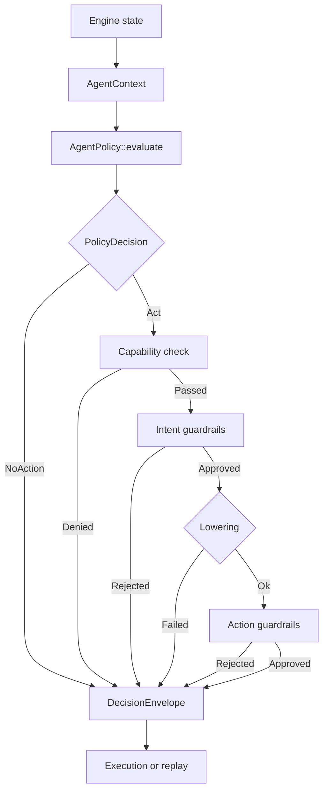

# Nautilus Agents


[](https://discord.gg/NautilusTrader)

Open agent protocol for [NautilusTrader](https://nautilustrader.io).

This crate defines the contract between an agent policy and the Nautilus
trading engine. Agents observe state, express decisions through a
structured protocol, and every cycle is recorded for replay and audit.

- Automate backtest iteration: hypotheses, parameter sweeps, result
  comparison.
- Monitor live systems: detect anomalies, reduce exposure, escalate.
- Record every decision for reproducible analysis.

> [!WARNING]
> Early development. The API is not yet stable.

## Platform

[NautilusTrader](https://nautilustrader.io) is an open-source,
high-performance, production-grade algorithmic trading platform. It lets
traders backtest automated strategies on historical data with an
event-driven engine, then deploy those same strategies live with no code
changes.

NautilusTrader's design, architecture, and implementation philosophy put
correctness and safety first. The platform targets backtesting and live
trading workloads where mistakes cost real money.

## What this crate includes

`nautilus-agents` is the open protocol layer. It sits on top of the open
NautilusTrader crates and reuses their real model types.

- `AgentContext`: owned, bounded snapshot of engine state built from
  `QuoteTick`, `Bar`, `AccountState`, `PositionSnapshot`, `OrderSnapshot`,
  and `PositionStatusReport`.
- `AgentPolicy`: the trait a policy implements.
- `PolicyDecision`: `Act(AgentIntent)` or `NoAction`.
- `AgentIntent`: semantic actions with execution constraints.
- `CapabilitySet`: explicit observation and action permissions.
- Intent and action guardrail traits.
- Lowering from `AgentIntent` to `RuntimeAction`.
- `DecisionPipeline`: the policy, capability, guardrail, and lowering loop.
- `DecisionEnvelope`: the canonical record for one decision cycle.
- `DecisionRecorder`: line-delimited JSON recording for envelopes.

## How the pieces fit together

The crate keeps agent reasoning separate from execution details:



## What this crate does not ship

This crate does not ship:

- An LLM runtime, agent harness, or prompt framework.
- A chat UI or Telegram-style control surface.
- The live MCP or axum server.
- Broker IDs, venue credentials, or hosted execution infrastructure.
- Hosted replay storage, dashboards, or fleet orchestration.
- RBAC, approvals, or team workflow services.

You bring your own runtime. A separate server layer can sit on top of this
protocol for live venue access and product features.

## Capability tiers

The protocol defines three capability tiers, ordered by where agents
deliver the most value first.

**Research.** Backtest iteration, hypothesis testing, parameter
optimization, result comparison. No venue risk, no capital at stake.
The reasoning an agent does well and static rules handle poorly.

**Risk and reliability.** Anomaly detection, exposure reduction, order
cancellation, strategy pause, human escalation. Live but defensive:
the agent monitors and protects.

**Execution.** Agent-driven entry, limit orders, venue-specific
parameters. The full trading surface, unlocked after research and risk
management are proven.

## Current v0 scope

- `DecisionPipeline` runs policy evaluation, capability checks, dual
  guardrails, lowering, and envelope creation.
- Risk management intents are lowerable today:
  `ReducePosition`, `ClosePosition`, `CancelOrder`, `CancelAllOrders`.
- Research-mode types are defined. Research lowering is next.
- `DecisionRecorder` writes JSONL. Replay reads it back and compares
  outcomes across policy or guardrail changes.
- `PositionLimitGuardrail` enforces per-order quantity limits.

## Module map

| Module       | Purpose                                            |
|--------------|----------------------------------------------------|
| `context`    | Owned policy input built from Nautilus snapshots.  |
| `policy`     | `AgentPolicy`, `PolicyDecision`, `PolicyError`.    |
| `intent`     | Semantic action vocabulary and constraints.        |
| `capability` | Observation and action permissions.                |
| `guardrail`  | Intent-level and action-level guardrail traits.    |
| `guardrails` | Concrete guardrail implementations.                |
| `lowering`   | Intent-to-action translation.                      |
| `action`     | `RuntimeAction`, `TradeAction`, `ResearchCommand`. |
| `pipeline`   | End-to-end decision orchestration.                 |
| `envelope`   | Canonical decision record types.                   |
| `recording`  | JSONL recording for decision envelopes.            |
| `replay`     | Replay reader, runner, and outcome comparison.     |

## Relationship to NautilusTrader

This crate depends on the open NautilusTrader stack:

```text
nautilus-core / nautilus-model / nautilus-common
                      ^
                      |
              nautilus-agents
```

It does not duplicate engine models with protocol-native copies.
`AgentContext` uses the real Nautilus snapshot and report types directly.
`AgentIntent` is the seam between policy reasoning and execution.

## Documentation

See [the docs](https://docs.nautilustrader.io) for API details.

## License

The source code for NautilusTrader is available on GitHub under the
[GNU Lesser General Public License v3.0](https://www.gnu.org/licenses/lgpl-3.0.en.html).

---

NautilusTrader is developed and maintained by Nautech Systems, a technology
company specializing in the development of high-performance trading systems.
For more information, visit <https://nautilustrader.io>.

Use of this software is subject to the
[Disclaimer](https://nautilustrader.io/legal/disclaimer/).


Copyright 2015-2026 Nautech Systems Pty Ltd. All rights reserved.
